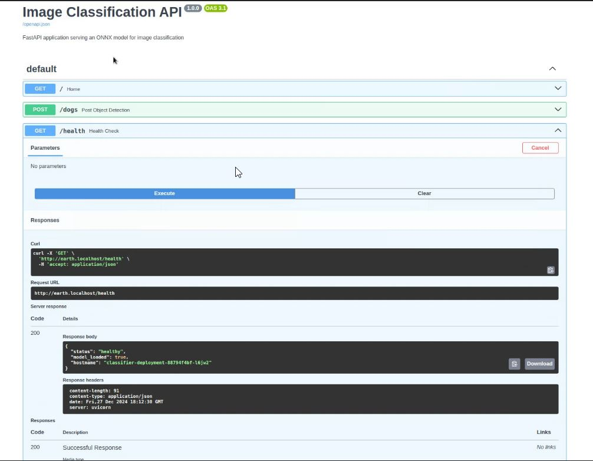
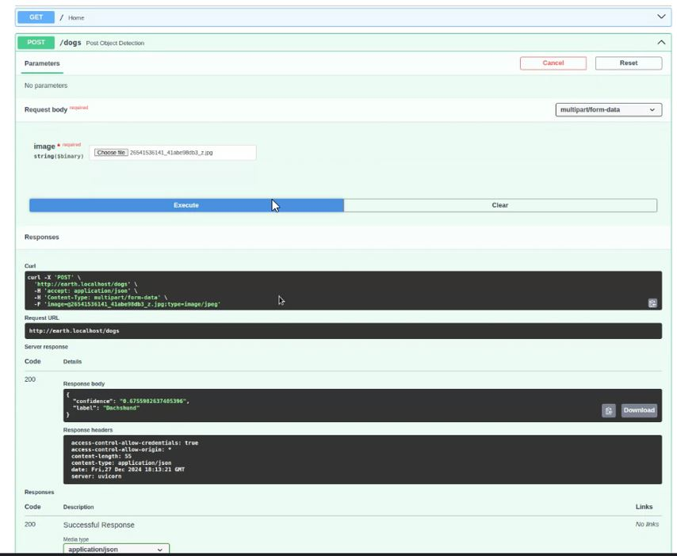
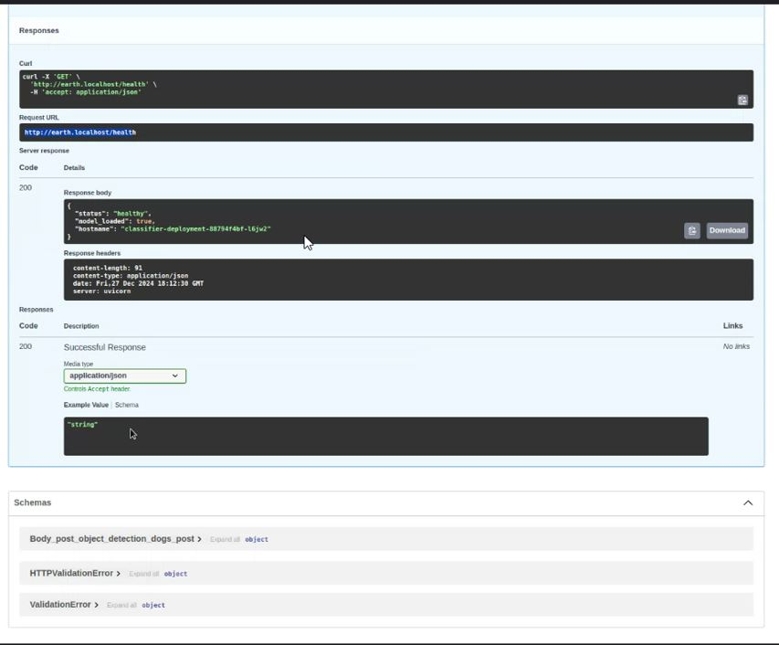
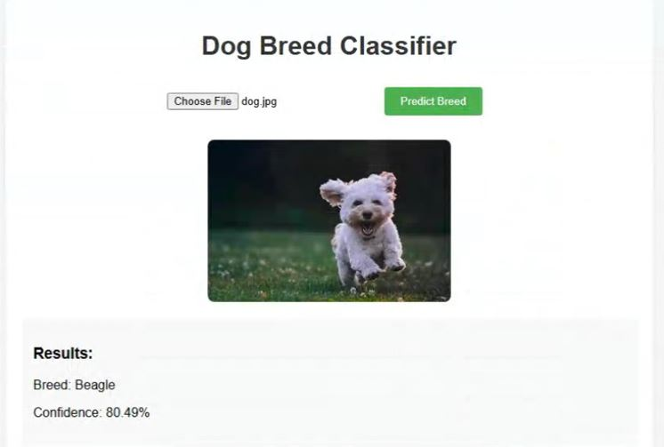
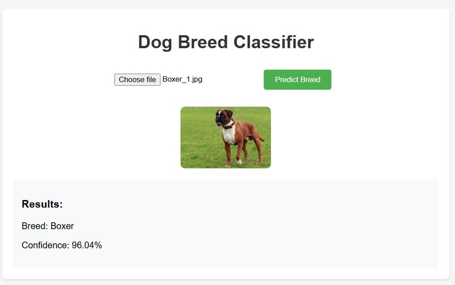
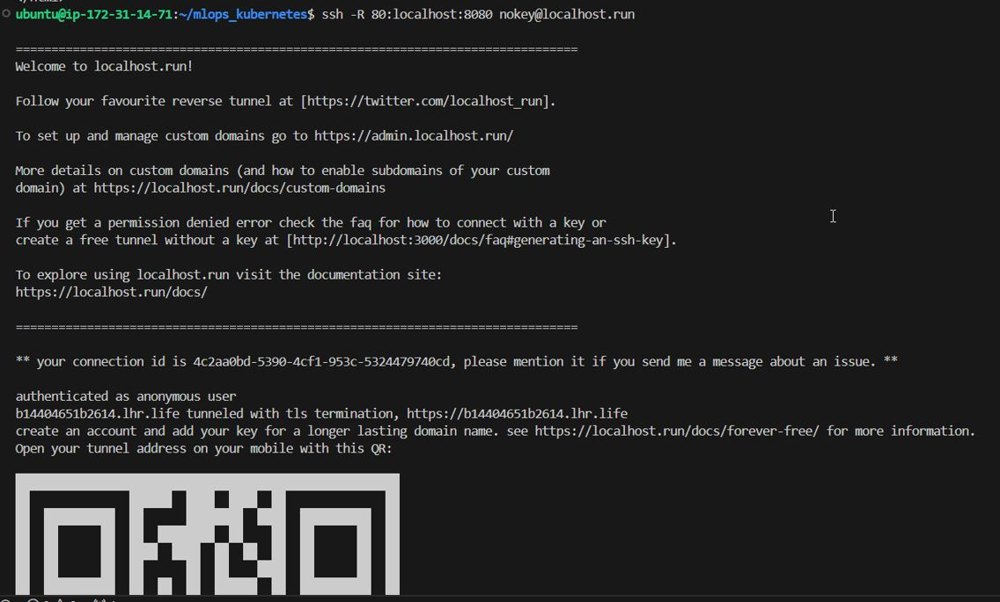
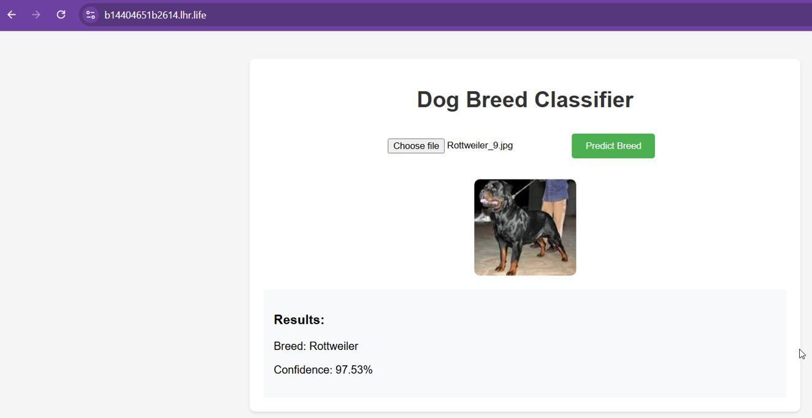

# Session 13 - FastAPI Deployment with Kubernetes

## Overview

This guide provides step-by-step instructions to deploy a CatDog/Dog Breed Classifier application using FastAPI on a Kubernetes cluster. The deployment includes two replicas of the model service, a service for communication, and an ingress for external access. The application uses FastHTML for the frontend and is tested with a local Minikube cluster or an EC2 instance (t3a.medium).

## Prerequisites

- **Minikube Installation:** Ensure Minikube is installed locally or set up an EC2 instance with Minikube.

- **Kubernetes CLI:** Install kubectl to manage the cluster.

- **Docker:** Build and push the Docker image for the FastAPI application.

- **ONNX Model:** Ensure the ONNX model file mambaout.onnx is included in your project directory.

## Installation and Setup of Minikube

### Install Minikube


```
curl -LO https://storage.googleapis.com/minikube/releases/latest/minikube_latest_amd64.deb
sudo dpkg -i minikube_latest_amd64.deb
minikube version
```

### Install Docker

Follow steps 1 to 3 from the official Docker installation guide for Ubuntu: 

### Start Minikube

```
sudo chmod 666 /var/run/docker.sock
minikube start --driver=docker
minikube status
minikube profile list
```

## Deployment Steps

### Step 1: Clone the Repository

```
git clone https://github.com/mHemaAP/emlov4_kubernetes.git
cd emlov4_kubernetes/s13-emlov4-mkube-intro/
```

### Step 2: Build and Enable Minikube Addons


```
docker build -t minikube_classifier .

alias mkubectl='minikube kubectl --'
mkubectl get pods
mkubectl config set-context --current --namespace=default
minikube addons enable dashboard
minikube addons enable ingress
minikube addons enable metrics-server

```

### Step 3: Create the Deployment

Apply the YAML files to create the deployment and service:


```
kubectl apply -f classifier.yaml
```

### Step 4: Tunnel to the Ingress

Minikube requires a tunnel to expose the ingress:

```
minikube tunnel &
```

### Step 5: Access the FastAPI Application

Add the following entry to your `/etc/hosts` file:

```
127.0.0.1 earth.localhost
```

### Step 6: Access the FastAPI docs page:

```
http://earth.localhost/docs
```







### Step 7: Access the FastAPI metrics page:

```
http://earth.localhost/metrics
```

### Testing the Application

#### Validate API with cURL

Run the following command:


```
curl http://localhost:8080
```
This command sends a GET request to the FastAPI application running on localhost to check its health status or the default response.

```
curl -X POST -F "image=@dog.jpg" http://earth.localhost/predict
```

#### Expose Application via SSH Tunnel

Run the following command:


```
ssh -R 80:earth.localhost:80 nokey@localhost.run
```

This creates an SSH reverse tunnel, exposing the application running on localhost (port 80) to the internet. Replace with -v for verbose logs:


```
ssh -v -R 80:earth.localhost:80 nokey@localhost.run
```

#### Access the Application via QR Code

After running the SSH tunnel command, a QR code and a link will be displayed. Open the link on any device to access the UI of the FastAPI application remotely. This allows you to interact with the application even without direct access to the local machine hosting it.

### Expected Outputs - Kubernetes Descriptions

Included all the outputs of the commands in a markdown file named 


Docker Image

The Dockerfile for the FastAPI application builds and packages the application along with its dependencies. Push the image to a container registry:


```
docker build -t mHemaAP/classifier-mk-kbs .
docker push mHemaAP/classifier-mk-kbs
```

### Testing and Validation

Upload an image via the FastAPI `/dogs` endpoint.

Verify the response includes the predicted label and confidence.

#### Sample Response

```
{
  "label": "dog",
  "confidence": 0.98
}
```

#### APP Images









### Notes

Replace placeholders such as `<username>`, `<keyfile>.pem`, and `<EC2_PUBLIC_IP>` with actual values.

Include test results and screenshots in the `README.md` and `results.md` files.

Ensure `mambaout.onnx` is present in the project directory.

## Conclusion

This guide helps you deploy a scalable FastAPI application on Kubernetes. Validate the deployment by testing endpoints and verifying resource usage. Use the provided YAML files and Docker configuration to streamline the process.
